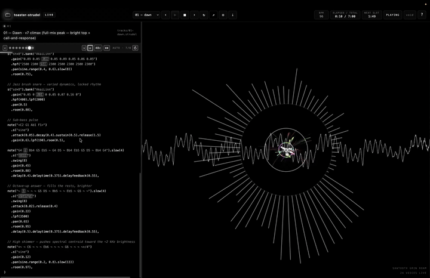

# toaster-strudel

Live-coding music workspace built on [Strudel](https://strudel.cc), driven by Claude Code agents. The repo contains skills that teach agents how to compose / perform / iterate on tracks, a browser-based player for live editing, and one worked example track.

**▶ Live radio — [toaster-radio.vercel.app](https://toaster-radio.vercel.app)** · a continuous, browser-synthesized showcase of tracks the agents cranked: a full-bleed visualizer and the Strudel source lighting up note-by-note as it plays. No backend.



The private fork that drove this includes a four-track EP and additional artist-style skills. This public release ships the framework, the player, and `style-bonobo` as a worked example of the artist-as-skill pattern.

## Vocabulary

Same words always mean the same thing:

| Term | What it is |
|---|---|
| **Album** | A release — a set of tracks played in sequence |
| **Track** | One song — a live file like `tracks/example.strudel`, optionally with a sibling directory `tracks/example/` holding section files |
| **Section** | One numbered file inside a track — `01.strudel`, `02.strudel`, …. Maps to song-structure: intro / verse / chorus / outro. (Used to be called "slot" or "snapshot.") |
| **Voice** | One parallel sound source inside a section (drone, bells, kick, …). Sometimes called "layer" — picking *voice*. |
| **Motif** | The recurring melodic line |
| **Cycle** | One Strudel pulse, ~2.5s at `setcps(0.4)`. Strudel's native unit. |
| **Advance** | Moving from the current section to the next |

So a sentence reads cleanly: *"In track example, section 5 has 8 voices including the descending motif. Each section runs for N cycles before the player advances. At the end of the last section the player loops the track — or, in radio mode, advances to the next track."*

## Layout

```
strudel-skills/
├── tracks/
│   └── example.strudel          ← worked example (add your own tracks here)
├── skills/skills/
│   ├── strudel-conduct/         ← the master live-performance guide
│   ├── strudel-compose/         ← writing tracks
│   ├── strudel-iterate/         ← A/B variation workflow
│   ├── strudel-sample-library/  ← what samples we have + how to load more
│   ├── strudel-effects/         ← filters, modulation, the "weird stuff"
│   ├── strudel-modifiers/       ← complete modifier index (pattern construction,
│   │                              time, signals, randomness, scales, sample slicing)
│   ├── strudel-test/            ← verifying patterns via strudel.cc
│   └── style-bonobo/            ← example artist-style skill (production
│                                   lens with librosa analysis of Black Sands)
├── tools/
│   ├── server.mjs               ← backend: serves the app + track files + audio endpoints
│   ├── analyze-patterns.py      ← static analyzer (predicts per-section RMS
│   │                              from .strudel code, no audio render needed)
│   ├── analyze-wav.py           ← librosa analyzer for recorded WAVs
│   ├── eval-tracks.py           ← `make eval`: structural gates over every track
│   │                              (contrast / build-strip arc / baseline drift)
│   ├── loudness.py              ← `make loudness`: per-track playbackGain
│   │                              (BS.1770 LUFS from renders, or --predict)
│   └── render-strudel.mjs       ← offline Node renderer (blocked, see file)
└── web/                         ← the browser player (React + Vite)
    └── src/                       App.tsx · engine/ (Strudel audio) · chat/ (agent editor)
```

## Running the player

```bash
make play          # backend (:4747) + the React app at http://localhost:5273/
make stop          # stop the backend server
```

Auto-advance is on by default. Hit ▶ to start and the player moves through the sections, looping the track at the end. Turn on **radio** (📻 / `g`) to play continuously *across* tracks: at the end of each track's arc it hops to the next track in the station (and refetches the catalog, so freshly-generated tracks join the rotation).

To hear a track **as one continuous piece** instead of section-by-section, hit the **🎼 arc** toggle (`f`): it plays `tracks/<id>/arrange.strudel`, a generated single-file `arrange([cycles, …section…], …)` that stitches the whole arc together with no seams between sections. Regenerate these after editing sections with `make arrangements` (see [How sections work](#how-sections-work)).

## How sections work

When **auto-advance** (⟳ button or `A`) is on:

1. Each section plays for its declared duration (from `manifest.json` → `@cycles` directive → global default)
2. When the section timer fires, the player advances to the next section
3. After the last section the player **loops back to section 1** of the same track
4. With **radio** on (📻 / `g`), the last section instead **hops to the next track** in the station and keeps playing

When you **click a section dot manually**:

- If **reset-on-swap** (`↺` button or `Z`) is **ON** (default): the section timer restarts — the section you clicked gets its full duration to play
- If **reset-on-swap** is **OFF**: the timer keeps running — useful for previewing the very end of a section without resetting

To listen to the **whole arc as one continuous track**, toggle **🎼 arc** (`f`) — it plays the generated `tracks/<id>/arrange.strudel` (one `arrange()` pattern, no section seams) and the section auto-advance stands down. Rebuild these files from the sections any time with `make arrangements` (or `make arrangements ARGS="v2-gen/crank-glade"` for one); `tools/build-arrangements.mjs` mirrors the player's cycle resolution (`manifest.json` → `@cycles` → default).

## Keybinds (full list — see `?` in the player)

| Key | Action |
|---|---|
| `space` | play / stop |
| `←` `→` | previous / next track |
| `1`–`4` | jump to track N |
| `,` `.` | previous / next section |
| `a` | toggle auto-advance |
| `f` | toggle full-arrangement (🎼 arc) playback |
| `g` | toggle radio (continuous station) |
| `z` | toggle reset-on-swap |
| `\` | replay all sections once |
| `r` | reload current track from disk |
| `k` | refresh sections from disk |
| `t` | cycle theme |
| `[` `]` | tempo ±10% |
| `m` | mute / unmute |
| `h` | hum → melody |
| `c` | open / close the chat (agent editor) |
| `?` | this help overlay |
| `esc` | close overlays |
| shift-click a note | send it to the chat as a reference |
| click a note (stopped) | audition that note |
| click `32c` | change section-length default |

## Editing a track live

1. Open `tracks/example.strudel` (or any section file in a track directory) in your editor
2. Change something — add a voice, retune a note, etc.
3. Save
4. The player polls the file — the live working copy `tracks/<id>.strudel` every ~700ms, the section files `tracks/<id>/NN.strudel` every ~900ms — picks up the change, and crossfades into the new pattern at the next cycle boundary (when it's the copy/section you're currently hearing)

You can split a track into sections by creating a directory beside the live file — e.g. `tracks/example/` with `01.strudel`, `02.strudel`, …. Section files live-reload just like the live copy, and new ones appear on the timeline automatically — no manual refresh, though `r` reloads the whole track and `k` re-reads its sections on demand.

## Static analyzer

To diagnose dynamics without rendering audio:

```bash
uv run python3 tools/analyze-patterns.py 01-dawn
```

Outputs voice count, total gain (predicted RMS), rhythmic density, spectral brightness, and a bar chart per section. Tells you if the build-strip arc is working, if any section is too flat, etc.

## Quality gates (`make eval`)

The analyzer's diagnoses, promoted to hard assertions plus a regression
baseline — so an edit that flattens a track fails mechanically instead of
getting discovered by ear three tracks later:

```bash
make eval                        # every track: contrast / build-strip arc / baseline drift
make eval ARGS="v2-gen/crank-x"  # one track
make eval ARGS="--update"        # re-record baselines after an intended change
```

Per-track thresholds live in the track manifest's `"eval"` block (e.g.
`{ "allow_flat": true }` for an intentionally-static ambient piece).
Exit code is CI-able; `--json` for agents.

## Loudness normalization (`make loudness`)

The radio plays tracks back-to-back, so loudness mismatches lurch on every
hop. `make loudness` writes a per-track `"playbackGain"` into each manifest —
integrated LUFS (ITU-R BS.1770) measured from rendered WAVs in
`/tmp/strudel-renders` (the player's ⤓ offline render lands there), targeting
−14 LUFS; `--predict` adds a static estimate for unrendered tracks (relative
leveling, marked `"predicted"`, superseded by any later measurement). Both
players route output through a master GainNode and apply the gain on track
switch — within-track dynamics are untouched. Re-publish the radio
(`pnpm publish-tracks`) after re-running.

## Recording

The header `●` button records the audio output as a WAV. Then:

```bash
ffmpeg -i toaster-strudel_01-dawn_*.wav -c:a flac out.flac
```

To record a whole track, enable auto-advance, hit ●, hit play, let the timeline run through every section, then hit ● again. (For a non-realtime bounce of the current track, the `⤓` button renders it offline and downloads a WAV.)

## Sample library

See `skills/skills/strudel-sample-library/` for the full catalogue. Default load: ~850 sounds across drum machines, piano, VCSL orchestral (kalimba, vibraphone, marimba, sax), mridangam hand drums, EmuSP12 boom-bap, and the full TidalCycles Dirt-Samples set. More can be loaded with one line per pack.

## License

GNU General Public License v3.0. See `LICENSE`.
